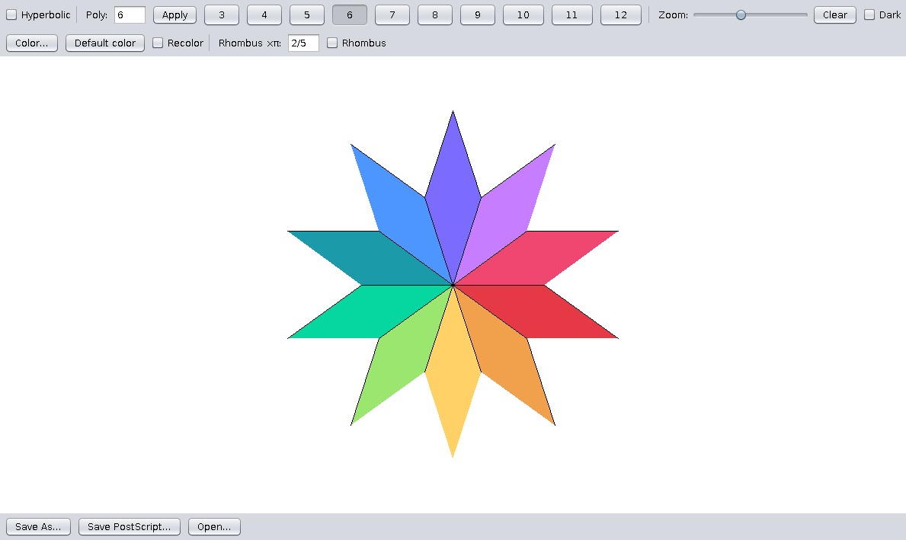

# Tyler

Tyler is an interactive program for building **tilings out of regular polygons**,
by Melinda Green and Don Hatch (Superliminal Software, 2002–2003).
You click near an open edge and a polygon of the currently selected type snaps
onto it, so tilings grow edge‑to‑edge under your control. Tyler works in three
geometries — the Euclidean plane, the hyperbolic plane (drawn in the Poincaré
disk), and the sphere — and can save and reload your work.

Project page: <https://superliminal.com/geometry/tyler/>

This README documents the original program together with a set of additions
(PostScript export, per‑tile colouring, rhombus tiles, and arc‑accurate
hyperbolic export) described in the [What's new](#whats-new-in-this-version)
section below.

---



Sample tilings and exported PostScript are in [`examples/`](examples/).

## Table of contents

- [Features](#features)
- [What's new in this version](#whats-new-in-this-version)
- [Installation](#installation)
- [Compiling from source](#compiling-from-source)
- [Running](#running)
- [Using the program](#using-the-program)
  - [The control panel](#the-control-panel)
  - [Mouse](#mouse)
  - [Keyboard](#keyboard)
- [Colouring tiles](#colouring-tiles)
- [Rhombus tiles](#rhombus-tiles)
- [Exporting PostScript](#exporting-postscript)
- [File format](#file-format)
- [Notes and limitations](#notes-and-limitations)
- [Credits](#credits)

---

## Features

- **Build tilings from regular polygons** (triangle through 12‑gon and beyond),
  and from **regular star polygons** such as the pentagram {5/2}.
- **Three geometries.** Euclidean (flat), hyperbolic (Poincaré disk, where the
  bounding circle is the infinite horizon), and spherical. The geometry is
  chosen from a *vertex configuration* — the list of polygons meeting at a
  vertex — which determines whether the resulting uniform tiling is flat,
  hyperbolic, or spherical.
- **Edge‑matching placement.** New tiles attach to the nearest unpaired
  ("perimeter") edge, so pieces line up automatically.
- **Pan, zoom, rotate, and axis‑snap** the view.
- **Save and load** drawings to a simple text format, plus (in the applet
  heritage) browser‑cookie and server save/load.
- **Extrapolate** — repeat the last placement step to continue a pattern.

The four additions below extend this without changing any existing behaviour.

---

## What's new in this version

1. **PostScript / EPS export.** Save a tiling as vector PostScript for printing,
   laser cutting, or importing into other documents. See
   [Exporting PostScript](#exporting-postscript).

2. **Per‑tile colour.** Tiles are still coloured by size by default, but you can
   now choose any colour for new tiles and recolour existing ones. See
   [Colouring tiles](#colouring-tiles).

3. **Rhombus tiles (Euclidean).** In addition to regular polygons you can place
   rhombi whose corner angle is any rational multiple of π — the tiles used in
   Penrose, Ammann–Beenker, and other non‑periodic tilings. See
   [Rhombus tiles](#rhombus-tiles).

4. **Arc‑accurate hyperbolic export.** In the Poincaré disk, exported edges are
   the true geodesics (arcs of circles meeting the boundary at right angles)
   rather than straight chords, so exported hyperbolic tilings are properly
   arc‑sided.

All additions are Euclidean‑and‑up compatible: existing tilings load unchanged,
and older Tyler builds are cleanly told to upgrade if handed a file that uses the
new features (the save format version was raised to `0.2.0`).

---

## Installation

Tyler is a Java program, so you need Java installed. To check, open a terminal
(Command Prompt or PowerShell on Windows) and run:

```
java -version
```

If that prints a version number, you can run the program. If it reports that the
command is not found, install Java first:

- **Ubuntu / Debian Linux:** `sudo apt install default-jre`
  (use `default-jdk` instead if you also want to compile — see below).
- **Windows / macOS:** install a JDK, e.g. *Eclipse Temurin* from
  <https://adoptium.net> (version 17 or newer recommended).

Then, with the prebuilt jar:

```
java -jar Tyler.jar
```

On Windows you can usually just double‑click `Tyler.jar` to launch it.

> **Run it as an application, not as a browser applet.** The original applet
> entry point no longer works on modern Java; the standalone application
> (`Tyler.jar`, or `java Tyler`) opens the same window directly and includes the
> save/load and PostScript features.

---

## Compiling from source

You need a **JDK** (which provides the `javac` compiler); the JRE alone is not
enough. Confirm with `javac -version`. On Ubuntu: `sudo apt install default-jdk`.

From the `tyler/` source directory (the folder containing `Tyler.java`):

```
javac *.java        # compile every .java file into .class files
java Tyler          # run the program (Tyler is the class containing main())
```

That is the whole edit‑build‑run cycle: change the source, `javac *.java`,
`java Tyler`.

To repackage a runnable jar the way the project's own build script does (leaving
the `GalleryBuilder` utility out of the app jar):

```
javac *.java
jar --create --file=Tyler.jar --manifest=Tyler.mf $(ls *.class | grep -v Galler)
java -jar Tyler.jar
```

On Windows the file‑list expression differs; the shipped `MakeAll.bat` does the
equivalent with `javac *.java` followed by a `jar` command.

**Expected warnings.** `javac` prints a few *deprecation* warnings about
`Applet` and `SecurityManager`. These are harmless — they come from the program
being written for 2002‑era Java — and do not affect compilation or running.

---

## Running

| How | Command |
|-----|---------|
| Prebuilt jar | `java -jar Tyler.jar` (or double‑click on Windows) |
| From compiled classes | `java Tyler` (run in the folder with the `.class` files) |
| New window while running | press `T` |

### Troubleshooting

**Double-clicking the jar does nothing / uses the wrong Java.** Double-click
launches with whatever Java your OS has associated with `.jar` files; if you have
more than one Java installed, that may be an old or incompatible one. Running it
from a terminal is the reliable way, because it uses the `java` on your PATH:

```
java -jar Tyler.jar
```

The jar is built for Java 11+, so any Java 11 or newer works this way. To force a
specific one, call it by full path, e.g. `/usr/lib/jvm/java-17.../bin/java -jar Tyler.jar`.


The program opens a drawing canvas with a control strip along the bottom and a
column of polygon buttons on the right. Start clicking on the canvas to place
tiles.

---

## Using the program

### The control panel

Along the bottom of the window:

- **Hyperbolic** checkbox — switch the current drawing into curved geometry.
  When enabled, a **Curvature based on** field appears where you type the vertex
  configuration (e.g. `7,7,7` for the {7,3} tiling of heptagons three‑to‑a‑vertex;
  `5,5,5,5` for {5,4}). The program computes whether that configuration is
  hyperbolic, spherical, or flat.
- **Poly:** field + **Apply** — type the polygon to place. A whole number `n`
  is a regular *n*-gon; a fraction `n/d` is a star polygon (e.g. `5/2` is a
  pentagram).
- **Polygon buttons `3`–`12`** (right column) — quick selection of a regular
  polygon.
- **Zoom** slider — scale the view.
- **Clear** — empty the drawing and start over.
- **Color…**, **Default color**, **Recolor** — see [Colouring tiles](#colouring-tiles).
- **Rhombus ×π** field + **Rhombus** checkbox — see [Rhombus tiles](#rhombus-tiles).

The standalone frame also has **Save As…** and **Open…** buttons for reading and
writing drawing files (and PostScript — see below).

### Mouse

| Action | Effect |
|--------|--------|
| **Click** | Place a tile of the current type at the unpaired edge nearest the cursor |
| **Shift‑click** | Place a detached tile at the cursor (Euclidean only) |
| **Drag** | Pan the view |
| **Ctrl‑drag** | Aim the *extrapolate* direction (a grey arrow); release, then press `e` |

### Keyboard

| Key | Action |
|-----|--------|
| `Space` | Place another tile of the current type at the nearest edge |
| `3`–`9` | Place a regular 3‑ to 9‑gon |
| `0`, `1`, `2` | Place a 10‑, 11‑, or 12‑gon |
| `u` | Undo the last tile placed |
| `d` | Delete the tile nearest the cursor |
| `m` | Move the last‑placed tile to the edge nearest the cursor |
| `e` | Extrapolate — repeat the last placement to continue the pattern |
| `a` | Toggle antialiasing (slow) |
| `A` | Toggle arc drawing of edges (hyperbolic) |
| `C` | Cycle the thickness of the bounding circle (hyperbolic) |
| `x` `y` `X` `Y` | Snap the nearest tile/edge/vertex to centre and align its neighbour to the +x/+y/−x/−y axis |
| Arrow keys | Slide the tiling, then axis‑align it |
| `Ctrl`+`←` / `Ctrl`+`→` | Rotate to the next axis‑aligned orientation |
| `T` | Open a new Tyler window |
| `Shift`+`Ctrl`+`C` | Reinitialise (clear) the drawing |
| `s` / `l` | Quick save / load to `polydata.txt` |

---

## Colouring tiles

By default each tile is coloured by its number of sides (triangles green,
squares red, and so on). You can override this per tile.

- **Color…** opens a colour picker; the colour you choose becomes the
  *current colour*, and every tile you place from then on uses it. The button
  tints to show the active colour.
- **Default color** returns to the size‑based scheme for newly placed tiles.
- **Recolor** (checkbox) changes what a click does: while it is ticked, clicking
  a tile repaints it with the current colour instead of adding a new tile.
  (With the current colour set back to *Default*, clicking a tile in Recolor
  mode clears its override and returns it to the size‑based colour.)

Colours are saved with the drawing and exported to PostScript.

Star polygons are drawn as outlines and are not filled, so setting a colour on a
star affects nothing visible — this matches the program's existing behaviour.

## Rhombus tiles

Rhombi are available in **Euclidean** mode. A rhombus has four equal (unit‑length)
sides and one free parameter — its corner angle — which you enter as a rational
number interpreted as a multiple of π:

- Type an angle such as `2/5` into the **Rhombus ×π** field, then tick the
  **Rhombus** checkbox (or just press Enter in the field). `2/5` means a corner
  angle of `2/5 × π = 72°`. The checkbox shows whether rhombus mode is on.
- With the box ticked, clicking (or `Space`) places rhombi with that corner
  angle at the nearest edge, exactly like polygons.
- Selecting any regular polygon (a polygon button or the **Poly** field), or
  un-ticking the box, switches back to placing polygons. The checkbox stays in
  sync, so it always reflects what a click will place.

Any angle strictly between `0` and `1` works (i.e. `0 < a/b < 1`, an interior
angle between 0 and π); an out-of-range or malformed value just beeps.

The corner angle is the interior angle at the shared‑edge corner, so entering the
**acute** angle or the **obtuse** angle gives the two possible orientations of
the rhombus on an edge — no separate flip control is needed. Useful values:

| Angle | Degrees | Used in |
|-------|---------|---------|
| `1/5`, `2/5` | 36°, 72° | Penrose rhombus tilings |
| `1/4` | 45° | Ammann–Beenker (with squares) |
| `1/3`, `2/3` | 60°, 120° | rhombille / "tumbling blocks" |

Because every side is unit length, rhombi share edges with the regular polygons
and with one another, so the two tile families can be mixed freely.

## Exporting PostScript

There are two ways to export. The simplest is the **Save PostScript…** button,
which always writes PostScript (it adds a `.ps` extension if you don't). The
**Save As…** button writes Tyler's normal `.txt` drawing format — but if you
type a name ending in `.ps` or `.eps` there, it writes PostScript too. The result is an
Encapsulated PostScript file with a correct bounding box, so it prints on its own
and also imports cleanly into other documents.

- The whole tiling is fit to the page by its own bounding box (it is not a
  screenshot of the current pan/zoom).
- Tiles are filled with their on‑screen colour and outlined in black; star
  polygons are outlined but not filled, matching the display.
- **Euclidean and spherical** tilings export with straight edges (Tyler draws
  spherical edges as straight chords, so this matches the screen).
- **Hyperbolic** tilings export with true geodesic edges — arcs of circles
  orthogonal to the boundary of the Poincaré disk — for both fills and outlines,
  so exported hyperbolic tiles are properly arc‑sided.

## File format

Drawings are saved as plain text beginning with a version line, currently:

```
tyler data format 0.2.0
```

followed by the curvature, the vertex configuration (when curved), a count and
list of tiles, a count and list of perimeter edges, and the view scale/focus.
Each tile line is the polygon symbol followed by its vertices:

```
4   x0,y0 x1,y1 x2,y2 x3,y3
```

with two **optional trailing tokens**, in any order:

- `@a/b` — marks the quadrilateral as a **rhombus** with corner angle
  `a/b × π` (added in 0.2.0).
- `#rrggbb` — an explicit **tile colour** in hex (added in 0.1.1).

For example, a teal 72° rhombus with unit sides:

```
4   0.000,0.000 0.309,-0.951 1.309,-0.951 1.000,0.000 @2/5 #008080
```

The format remains backward compatible: files without these tokens load exactly
as before, and older Tyler builds that predate them are cleanly asked to upgrade
rather than misreading the new files.

## Modern UI (Swing + FlatLaf)

Tyler ships with two front ends over the same drawing engine:

- **`Tyler`** — the original AWT UI (also the applet entry point).
- **`TylerSwing`** — a modern Swing UI with a flat, themeable look via
  [FlatLaf](https://www.formdev.com/flatlaf/), including a light/dark toggle and
  HiDPI scaling. The canvas and all tiling logic are shared and unchanged; only
  the surrounding controls differ.

Run the modern UI:

```
javac *.java
java TylerSwing            # or: java -jar Tyler_swing.jar
java TylerSwing            # theme follows the OS light/dark setting automatically
java TylerSwing -dark      # force dark   (or -light to force light)
java TylerSwing mytiling.txt   # open a file on startup
```

**FlatLaf is optional.** If its jar isn't on the classpath, `TylerSwing` falls
back to the JDK's built-in Nimbus look and prints a note. To get the full flat
theme, download FlatLaf from Maven Central and put it on the classpath — the
simplest is to save it next to the jar as `flatlaf.jar` (the jar's manifest
already references that name), so `java -jar Tyler_swing.jar` picks it up:

```
# any recent 3.x works; save it as flatlaf.jar
curl -L -o flatlaf.jar https://repo1.maven.org/maven2/com/formdev/flatlaf/3.4.1/flatlaf-3.4.1.jar
java -jar Tyler_swing.jar          # now uses the FlatLaf theme
# or explicitly on the classpath:
java -cp "Tyler_swing.jar:flatlaf.jar" TylerSwing      # Linux/macOS
java -cp "Tyler_swing.jar;flatlaf.jar" TylerSwing      # Windows
```

### One self-contained jar (nothing to download)

To bundle FlatLaf into a single runnable jar so there's nothing to fetch at run
time, run the included build script (needs a JDK and `curl`):

```
./make-fatjar.sh          # Linux/macOS   (make-fatjar.bat on Windows)
java -jar Tyler.jar       # self-contained: modern UI + FlatLaf, theme follows the OS
```

The script compiles Tyler, downloads FlatLaf once from Maven Central, and merges
everything into one `Tyler.jar` (FlatLaf's classes and theme resources included),
with `TylerSwing` as the main class. After the first run FlatLaf is cached as
`flatlaf.jar`, so rebuilds are offline.

Implementation note: `TylerSwing` hosts the existing heavyweight `TylerPanel`
canvas inside a `JFrame`, and both front ends talk to the canvas through the
small `TylerHost` interface (which supplies the hyperbolic-controls and
rhombus-sync callbacks). Nothing in the tiling engine changed.

## Notes and limitations

- **Rhombi are Euclidean‑only.** In hyperbolic or spherical mode the rhombus
  tool falls back to placing the current regular polygon, because unit‑edge
  rhombi and the curved‑geometry construction don't combine simply.
- **Extrapolate (`e`) repeats polygons, not rhombi.** Rhombus extrapolation is a
  different geometric operation and is not implemented.
- **The colour picker (Color…) appears only in the standalone application**, not
  in the legacy applet, because it uses a Swing dialog.
- Compiling on modern Java produces harmless deprecation warnings, as noted
  under [Compiling from source](#compiling-from-source).

## Credits

Original program written by **Melinda Green** and **Don Hatch**
(Superliminal Software). See <https://superliminal.com/geometry/tyler/> and the
accompanying Tyler Art Gallery. The additions described under
[What's new](#whats-new-in-this-version) extend that work.
